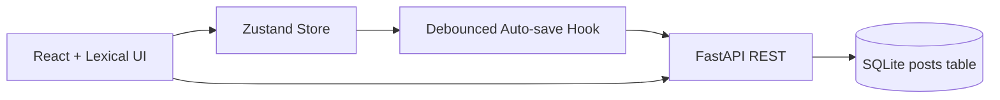

# Architecture

## High-Level Design

- `src/` is a frontend app that owns editor UX, state orchestration, and auto-save behavior.
- `backend/app/` is an API service that persists drafts and publish status in SQLite.
- Lexical state is stored as serialized JSON end-to-end (frontend -> API -> DB -> frontend restore).

## Frontend LLD

- `src/editor/EditorShell.jsx`
  - Initializes Lexical and composes plugins.
  - Registers nodes (`Table*`, custom `MathNode`, list/heading/link).
- `src/editor/Toolbar.jsx`
  - UI-only control layer.
  - Dispatches Lexical commands for formatting, lists, tables, and math insertion.
- `src/editor/plugins/MathPlugin.jsx`
  - Registers custom `INSERT_MATH_COMMAND`.
- `src/editor/nodes/MathNode.jsx`
  - Custom `DecoratorNode` that renders KaTeX and supports inline editing.
- `src/store/editorStore.js`
  - Global state slices: drafts, selected post, serialized content, save lifecycle flags.
- `src/hooks/useAutoSave.js`
  - Custom debounce algorithm, avoids redundant PATCH calls using last-saved content comparison.
- `src/api/postsApi.js`
  - Backend API adapter.

## Backend HLD/LLD

- `backend/app/main.py`
  - REST endpoints:
    - `POST /api/posts/`
    - `GET /api/posts/`
    - `PATCH /api/posts/{id}`
    - `POST /api/posts/{id}/publish`
    - `POST /api/ai/generate`
  - Simple AI summary endpoint for bonus requirement.
- `backend/app/models.py`
  - `Post` entity stores title, content (Lexical JSON string), status, timestamps.
- `backend/app/database.py`
  - SQLAlchemy engine/session setup.
- `backend/app/schemas.py`
  - Request/response contracts.

## Design Decisions

- Lexical JSON persistence: preserves exact block/node structure without lossy conversions.
- Zustand over local component state: keeps cross-view data (draft list + editor status) synchronized.
- Debounce (1200ms): balances API load and data safety.
- SQLite for assignment: no external infra needed while keeping backend structure production-like.
